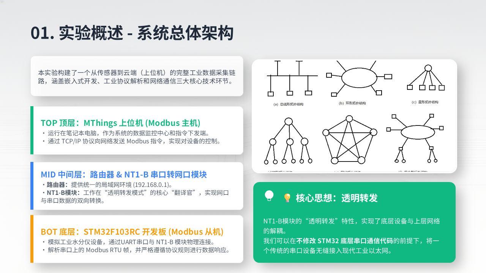
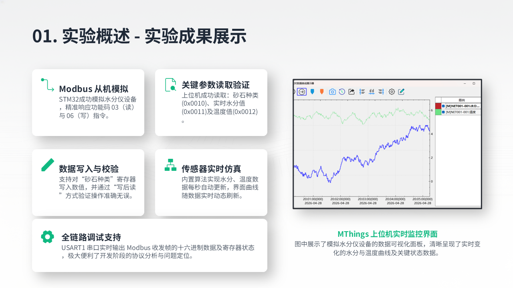

# 基于 Modbus 协议的 STM32 水分仪通信系统

[English](./README.md) · [实验报告](./docs/experiment-report.docx) · [项目汇报](./presentation/project-presentation.pptx)

[](https://www.st.com/en/microcontrollers-microprocessors/stm32f103rc.html)
[](https://modbus.org/)
[](https://www.iso.org/standard/82075.html)
[](https://www.keil.com/)
[](./LICENSE-CONTENT.md)

STM32F103RC 模拟水分仪 Modbus 从机，EBYTE NT1-B 完成 UART 与以太网透明转发，MThings 作为上位机主站，构成一条完整的工业通信实验链路。



## 项目基本信息

| 项目 | 内容 |
|---|---|
| 项目时间 | **2026 年 4 月**（终稿日期为 2026-04-30） |
| 项目组长 | **胡荣杰** |
| 实际开发者 | **胡荣杰——唯一实际设计与开发者** |
| 贡献说明 | 课程小组中如有其他关联姓名，均为挂名；固件、协议实现、网络配置、硬件联调、故障排查、实验验证、PPT 与实验报告均由 **胡荣杰一人完成**。 |
| 项目类型 | 嵌入式固件 + 工业协议 + 网络集成实验 |
| 原型成本 | **现有资料未记录，待后续补充** |
| 完成状态 | 已完成 FC03/FC06、网络桥接、上位机监控和读写验证 |

## 商业化与应用分析

该原型展示了传统串口仪表低成本联网改造方案：保留 RTU 设备固件，在前端增加串口转以太网透明桥。相同模式可用于水分仪、称重仪表、环境传感器、实验装置和需要接入局域网监控的老旧工业设备。

若要产品化，需将模拟数据替换为经过标定的真实传感器采集，并增加隔离 RS-485、浪涌/ESD 防护、看门狗恢复、标准 Modbus 异常响应、配置安全、设备部署和长期可靠性测试。当前成果是已验证的通信原型，不是可直接用于生产计量的水分仪。

## 系统架构与协议

```text
MThings 主站
    │ TCP/IP
路由器 / 局域网
    │ TCP，端口 502
EBYTE NT1-B（透明转发）
    │ UART，9600 bps，8N1
STM32F103RC Modbus RTU 从机，地址 0x01
```

本实验采用 **Modbus RTU over TCP**，不是原生 Modbus TCP。NT1-B 只按字节透明转发，不转换协议；如果 MThings 选择 Modbus TCP，会增加 7 字节 MBAP 头，STM32 收到的首字节变为 `0x00` 而不是从机地址 `0x01`，因此丢弃报文。改用 RTU over TCP 后完成了全链路通信。

### 已实现寄存器表

| 地址 | 寄存器 | 权限 | 初始/原始值 | 上位机显示 |
|---|---|---|---:|---:|
| `0x0010` | 砂石种类 | 读写 | `1` | `1` |
| `0x0011` | 模拟实时水分值 | 只读 | `128` | `12.8%` |
| `0x0012` | 模拟温度值 | 只读 | `253` | `25.3 ℃` |

水分和温度按实际值 ×10 存储，并通过有界伪随机游走每秒更新。它们是**模拟信号**，不是物理水分传感器的测量值。

### 固件逻辑

- USART2 以 `9600 bps, 8N1` 中断接收 RTU 报文；
- 主循环在收到数据后等待 20 ms，校验从机地址和 CRC16-Modbus，再分发功能码；
- `0x03` 读取保持寄存器，`0x06` 写单个允许写入的寄存器并回显请求；
- 水分、温度寄存器拒绝 FC06 写入；
- USART1 以 `115200 bps` 输出启动状态、模拟值、收发帧和寄存器操作。



## 已验证结果

- MThings 经以太网/UART 完整链路成功读取三个寄存器；
- 向 `0x0010` 写入 `3` 后收到 FC06 规定的原帧回显，并可再次读回；
- 向只读 `0x0011` 写入时固件拒绝响应，上位机超时；
- 模拟水分与温度曲线可持续刷新；
- USART1 能输出十六进制请求与应答帧。

## 编译与复现

1. 在 Keil MDK 5 中打开 `USER/Moisture_Meter.uvprojx` 并编译 STM32F103RC 工程；
2. 使用 ST-Link 烧录；
3. STM32 `PA2 (TX)` 接 NT1-B `RXD`，`PA3 (RX)` 接 `TXD`，两端共地；
4. 将 NT1-B 配置为 TCP Server、串口 `9600 8N1`，并设置为上位机局域网可达的地址；
5. MThings 选择 **Modbus RTU over TCP**、从机地址 `1`，添加地址 16–18。

实验报告中的原始地址是 `192.168.0.10:502`；复现实验时应按自己的网络选择无冲突地址。

## 仓库内容

- `USER/main.c`：协议、寄存器、传感器模拟与双串口逻辑
- `docs/experiment-report.docx`：新增的完整原始实验报告
- `presentation/project-presentation.pptx`：原始 44 页实验汇报
- `assets/`：从汇报中导出的 README 配图

## 当前限制与扩展方向

- 尚未连接真实水分传感器；
- 报文边界采用固定 20 ms 等待，而不是定时器/空闲线状态机；
- 非法写入直接丢弃，没有返回标准 Modbus 异常帧；
- 尚未实现 FC16、原生 Modbus TCP、RS-485 多从机、鉴权和云端遥测。

## 协议

项目原创实验报告、汇报和图片采用 **CC BY-NC-SA 4.0**；详见 [LICENSE-CONTENT.md](./LICENSE-CONTENT.md)。源码及第三方厂商组件仍遵循各自文件中注明的许可条款。
